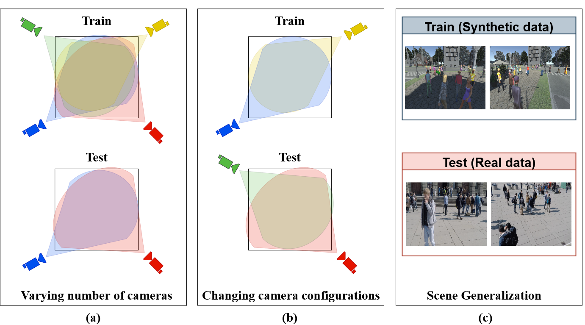
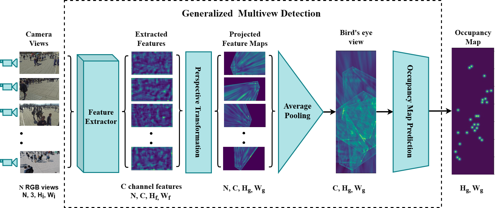
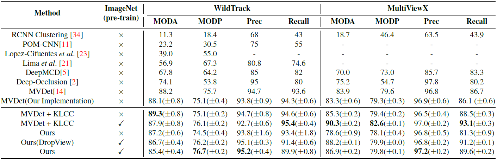
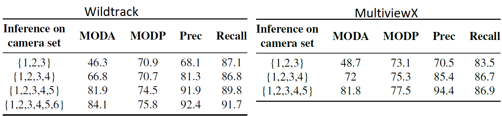
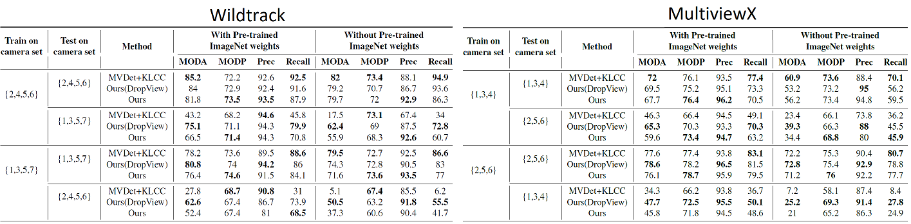
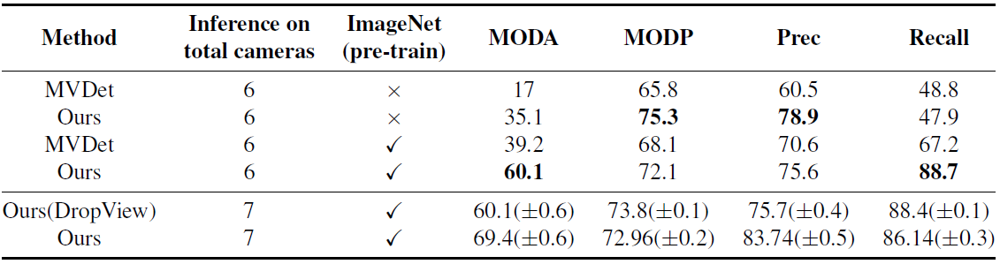

# Bringing Generalization to Deep Multi-view Detection


## Abstract
Multi-view Detection (MVD) is highly effective for occlusion reasoning and is a
mainstream solution in various applications that require accurate top-view occupancy
maps. While recent works using deep learning have made significant advances in the
field, they have overlooked the generalization aspect, which makes them impractical
for real-world deployment. The key novelty of our work is to formalize three critical
forms of generalization and propose experiments to investigate them: i) generalization
across a varying number of cameras, ii) generalization with varying camera positions,
and finally, iii) generalization to new scenes. We find that existing state-of-the-art models
show poor generalization by overfitting to a single scene and camera configuration. We
propose modifications in terms of pre-training, pooling strategy, regularization, and loss
function to an existing state-of-the-art framework, leading to successful generalization
across new camera configurations and new scenes. We perform a comprehensive set of
experiments on the WildTrack and MultiViewX datasets to (a) motivate the necessity to
evaluate MVD methods on generalization abilities and (b) demonstrate the efficacy of
the proposed approach.

## Architecture


## Dataset
* Wildtrack dataset can be downloaded from this [link](https://www.epfl.ch/labs/cvlab/data/data-wildtrack/).
* MultiviewX dataset can be downloaded from this [link](https://github.com/hou-yz/MultiviewX).

## Installation and Dependencies

* Install all requirements required to run the code on a Python 3.x by:
 ```	
# First, activate a new virtual environment
$ pip install -r requirements.txt
 ```
* Installation using conda :
 ```
$ conda env create -f environment.yml
 ```
 
* Download dataset and place it inside folder `GMVD/`
* Copy config.json file to Dataset folder 
```
# For Wildtrack
[GMVD]$ cp configuration/wildtrack/config.json ~/GMVD/Wildtrack/

# For MultiviewX
[GMVD]$ cp configuration/multiviewx/config.json ~/GMVD/MultiviewX/
```

## General Intructions
* All the experiments are perfomed using 2 Nvidia 1080Ti GPU's
```
example : python main.py -b 1 --avgpool
```

## Training
For training, 
* ``training_commands/train.sh`` contains commands to run training in normal setting.
* ``training_commands/train_dropview.sh`` contains commands to run training with dropview regularization.

## Inference
* Clone this repository and download the pretrained weights from this [link](https://iiitaphyd-my.sharepoint.com/:f:/g/personal/jeet_vora_research_iiit_ac_in/EoZySkQaB2NAuBqbyGwwwX0BP4Ma33QIWdMvlJrczeQoHQ?e=2Z7xgT)
* Arguments to specific
```
--avgpool : to use average pooling
--dropview : enable dropview (note: --avgpool is also activated)
-d <dataset_name> : specify dataset eg:- wildtrack/multiviewx
```

* Inference for varying cameras
```
## Syntax Example : python main.py --avgpool --cam_set --train_cam 1 2 3 4 5 6 7 --test_cam 1 2 3 4 --resume <foldername>/<filename.pth>

# For Wildtrack
[GMVD]$ python main.py --avgpool --cam_set --train_cam 1 2 3 4 5 6 7 --test_cam 1 2 3 4 --resume trained_models/wildtrack/traditional_eval/Multiview_Detection_wildtrack.pth

# For MultiviewX
[GMVD]$ python main.py -d multiviewx --avgpool --cam_set --train_cam 1 2 3 4 5 6 --test_cam 1 2 3 4 --resume trained_models/multiviewx/traditional_eval/Multiview_Detection_multiviewx.pth
```

* Inference for changing camera configurations
```
## Syntax Example : python main.py --avgpool --cam_set --train_cam 2 4 5 6 --test_cam 1 3 5 7 --resume <foldername>/<filename.pth>

# For Wildtrack
[GMVD]$ python main.py --avgpool --cam_set --train_cam 2 4 5 6 --test_cam 1 3 5 7 --resume trained_models/wildtrack/changing_cam/Multiview_Detection_wildtrack_2456.pth

# For MultiviewX
[GMVD]$ python main.py -d multiviewx --avgpool --cam_set --train_cam 1 3 4 --test_cam 2 5 6 --resume trained_models/multiviewx/changing_cam/Multiview_Detection_multiviewx_134.pth
```

* Inference for scene generalization
```
[GMVD]$ python main.py -d wildtrack --avgpool --resume trained_models/multiviewx/traditional_eval/Multiview_Detection_multiviewx.pth
```

## Results
### Traditional Evaluation

### Varying Number of Cameras

### Changing Camera Configurations

### Scene Generalization

