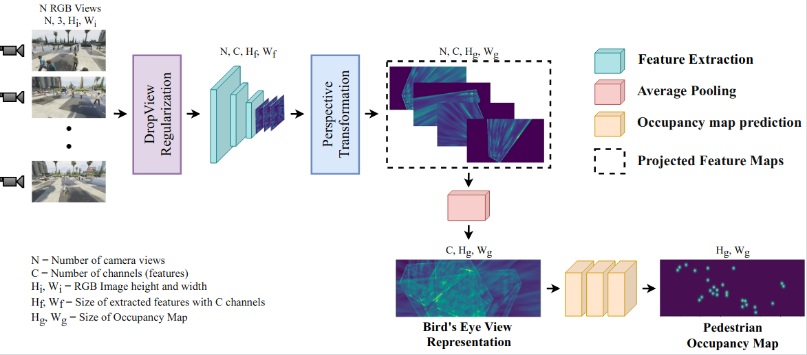
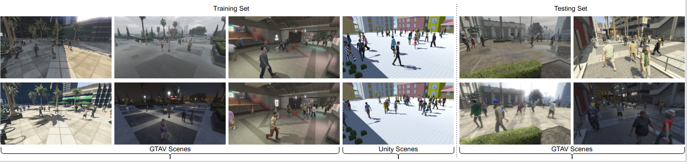

# Bringing Generalization to Deep Multi-view Pedestrian Detection [[WACV](https://openaccess.thecvf.com/content/WACV2023W/RWS/html/Vora_Bringing_Generalization_to_Deep_Multi-View_Pedestrian_Detection_WACVW_2023_paper.html)][[arXiv](https://arxiv.org/abs/2109.12227)]


## Abstract
Multi-view Detection (MVD) is highly effective for occlusion reasoning in a crowded environment. While recent works using deep learning have made significant advances in the field, they have overlooked the generalization aspect,which makes them impractical for real-world deployment.The key novelty of our work is to formalize three critical forms of generalization and propose experiments to evaluate them: generalization with i) a varying number of cameras, ii) varying camera positions, and finally, iii) to new scenes. We find that existing state-of-the-art models show poor generalization by overfitting to a single scene and camera configuration. To address the concerns: (a) we propose a novel Generalized MVD (GMVD) dataset, assimilating diverse scenes with changing daytime, camera configurations, varying number of cameras, and (b) we discuss the properties essential to bring generalization to MVD and propose a barebones model to incorporate them. We perform a comprehensive set of experiments on the WildTrack, MultiViewX and the GMVD datasets to motivate the necessity to evaluate generalization abilities of MVD methods and to demonstrate the efficacy ofthe proposed approach.

## Architecture


## GMVD Dataset

The GMVD dataset contributes to generalized multi-view detection with overlapping field-of-view. We build a synthetic dataset for multi-view detection using Grand theft Auto V (GTAV) and Unity Game Engine. The GMVD dataset includes seven distinct scenes, one indoor (subway) and six outdoors. One of the scenes are reserved for the test split. We vary the number of total cameras in each scene and provide different camera configurations within a scene. Additional salient features of GMVD include daytime variations (morning, afternoon, evening, night) and weather variations (sunny, cloudy, rainy, snowy). The images in the dataset are of high resolution, 1920x1080, and are synchronized. Average coverage varies from 2.76-6.4 cameras depending on the scene.

* Dataset links and instructions are provided here [link](https://github.com/jeetv/GMVD_dataset).

## Publicly Available Dataset
* Wildtrack dataset can be downloaded from this [link](https://www.epfl.ch/labs/cvlab/data/data-wildtrack/).
* MultiviewX dataset can be downloaded from this [link](https://github.com/hou-yz/MultiviewX).

## Installation and Dependencies

* Install all requirements required to run the code on a Python 3.x by:
 ```	
# First, activate a new virtual environment
$ pip install -r requirements.txt
 ```
* Installation using conda :
 ```
$ conda env create -f environment.yml
 ```
 
* Download dataset and place it inside folder `GMVD/`
* Copy config.json file to Dataset folder 
```
# For Wildtrack
[GMVD]$ cp configuration/wildtrack/config.json ~/GMVD/Wildtrack/

# For MultiviewX
[GMVD]$ cp configuration/multiviewx/config.json ~/GMVD/MultiviewX/
```

## General Intructions
* All the experiments are perfomed using 1 Nvidia 1080Ti GPU

## Training
For training, 
* ``training_commands/train.sh`` contains commands to run training in normal setting.
* ``training_commands/train_dropview.sh`` contains commands to run training with dropview regularization.

## Inference
* Clone this repository and download the pretrained weights from this [link](https://iiitaphyd-my.sharepoint.com/:f:/g/personal/jeet_vora_research_iiit_ac_in/EoZySkQaB2NAuBqbyGwwwX0BP4Ma33QIWdMvlJrczeQoHQ?e=2Z7xgT)
* Arguments to specific
```
--avgpool : to use average pooling
--dropview : enable dropview (note: --avgpool is also activated)
-d <dataset_name> : specify dataset eg:- wildtrack/multiviewx
```

* Inference for varying cameras
```
## Syntax Example : python main.py --avgpool --cam_set --train_cam 1 2 3 4 5 6 7 --test_cam 1 2 3 4 --resume <foldername>/<filename.pth>

# For Wildtrack
[GMVD]$ python main.py --avgpool --cam_set --train_cam 1 2 3 4 5 6 7 --test_cam 1 2 3 4 --resume trained_models/wildtrack/traditional_eval/Multiview_Detection_wildtrack.pth

# For MultiviewX
[GMVD]$ python main.py -d multiviewx --avgpool --cam_set --train_cam 1 2 3 4 5 6 --test_cam 1 2 3 4 --resume trained_models/multiviewx/traditional_eval/Multiview_Detection_multiviewx.pth
```

* Inference for changing camera configurations
```
## Syntax Example : python main.py --avgpool --cam_set --train_cam 2 4 5 6 --test_cam 1 3 5 7 --resume <foldername>/<filename.pth>

# For Wildtrack
[GMVD]$ python main.py --avgpool --cam_set --train_cam 2 4 5 6 --test_cam 1 3 5 7 --resume trained_models/wildtrack/changing_cam/Multiview_Detection_wildtrack_2456.pth

# For MultiviewX
[GMVD]$ python main.py -d multiviewx --avgpool --cam_set --train_cam 1 3 4 --test_cam 2 5 6 --resume trained_models/multiviewx/changing_cam/Multiview_Detection_multiviewx_134.pth
```

* Inference for scene generalization
```
[GMVD]$ python main.py -d wildtrack --avgpool --resume trained_models/multiviewx/traditional_eval/Multiview_Detection_multiviewx.pth
```

## Citations
```
@InProceedings{Vora_2023_WACV,
    author    = {Vora, Jeet and Dutta, Swetanjal and Jain, Kanishk and Karthik, Shyamgopal and Gandhi, Vineet},
    title     = {Bringing Generalization to Deep Multi-View Pedestrian Detection},
    booktitle = {Proceedings of the IEEE/CVF Winter Conference on Applications of Computer Vision (WACV) Workshops},
    month     = {January},
    year      = {2023},
    pages     = {110-119}
}

```
If you use the above code also cite this:
```
@inproceedings{hou2020multiview,
  title={Multiview Detection with Feature Perspective Transformation},
  author={Hou, Yunzhong and Zheng, Liang and Gould, Stephen},
  booktitle={ECCV},
  year={2020}
}

```
